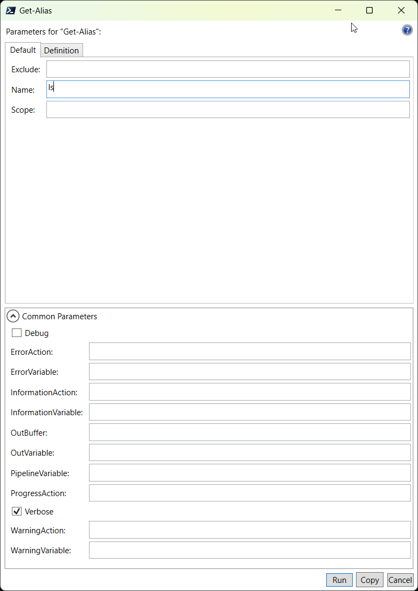

# Windows PowerShell and pwsh cheatsheet

## Sources for this cheatsheet

1. [Microsoft Learn](https://learn.microsoft.com/)
2. [GitHub public repo "PowerShell" by Microsoft](https://github.com/PowerShell/PowerShell)
3. [Microsoft Learn PowerShell Documentation](https://learn.microsoft.com/en-us/powershell/)
4. [Youtube Playlist "PowerShell Master Class (MC)" by John Savill](https://www.ist=PLlVtbbG169nFq_hR7FcMYg32xsSAObuq8)
5. [GitHub public repo "PowerShellMC" by John Savill](https://github.com/johnthebrit/PowerShellMC)

## PowerShell Versions

**Widows PowerShell Version (5.1):**

* The Windows PowerShell console
* The Windows PowerShell Integrated Scripting Environment (ISE)

PS C:\Users\\*\<Username\>*> `$PSVersionTable`

``` txt
Name                           Value
----                           -----
PSVersion                      5.1.22621.2506
PSEdition                      Desktop
PSCompatibleVersions           {1.0, 2.0, 3.0, 4.0...}
BuildVersion                   10.0.22621.2506
CLRVersion                     4.0.30319.42000
WSManStackVersion              3.0
PSRemotingProtocolVersion      2.3
SerializationVersion           1.1.0.1
```

**PowerShell (Core|.NET) Version (7.4):**

PS C:\Users\\*\<Username\>*> `$PSVersionTable`

``` txt
Name                           Value
----                           -----
PSVersion                      7.4.0
PSEdition                      Core
GitCommitId                    7.4.0
OS                             Microsoft Windows 10.0.22621
Platform                       Win32NT
PSCompatibleVersions           {1.0, 2.0, 3.0, 4.0…}
PSRemotingProtocolVersion      2.3
SerializationVersion           1.1.0.1
WSManStackVersion              3.0
```

### Summary | Differences between Widows PowerShell and PowerShell (Core|.NET)

| Description  | Windows PowerShell 5.1  | PowerShell 7.x  |
|---------|---------|---------|
| executable/cmd | `powershell.exe` | `pwsh.exe` |
| install location | `$env:WINDIR\System32\WindowsPowerShell\v1.0` | `$env:ProgramFiles\PowerShell\7` |
| profile location | `$HOME\Documents\WindowsPowerShell` | `$HOME\Documents\PowerShell` |

### Identifying and modifying the execution policy in PowerShell

To identify the effective execution policy for the current PowerShell session, use the following cmdlet:  
`Get-ExecutionPolicy`

You can configure the following policy settings:

* **AllSigned.** Limits script execution on all signed scripts. This setting requires that all scripts are signed by a trusted publisher, including scripts that you write on the local computer. It prompts you before running scripts from publishers that you haven't yet classified as trusted or untrusted. However, verifying the signature of a script doesn't eliminate the possibility of that script being malicious. It simply provides an extra check that minimizes this possibility.

* **Default.** Sets the default execution policy, which is Restricted for Windows clients and RemoteSigned for Windows servers.

* **RemoteSigned.** This is the default execution policy for Windows server computers. Scripts can run, but the policy requires a digital signature from a trusted publisher on scripts and configuration files that have been downloaded from the internet. This setting doesn't require digital signatures on scripts that are written on the local computer.

* **Restricted.** This is the default execution policy for Windows client computers. It permits running individual commands, but it doesn't allow scripts.
Unrestricted. This is the default execution policy for non-Windows computers, which you can't change. It allows unsigned scripts to run. This policy warns the user before running scripts and configuration files that aren't from the local intranet zone.
* **Undefined.** Indicates that there isn't an execution policy set in the current scope. If the execution policy in all scopes is Undefined, the effective execution policy is Restricted for Windows clients and RemoteSigned for Windows Server.

To change the execution policy in PowerShell, use the following command:  
`Set-ExecutionPolicy -ExecutionPolicy <PolicyName>`

### Discovering cmdlet and parameter names

Tab completion even works with wildcards. If you know you want a cmdlet that operates on services, but aren't sure which one you want, enter the text *-service in the console, and then press the Tab key to review all cmdlets that contain the text -service in their names.

PS C:\Users\\*\<Username\>*> `*-*service* + <Tab>`  
PS C:\Users\\*\<Username\>*> `Get-NetFirewallServiceFilter + <Tab>`  
PS C:\Users\\*\<Username\>*> `Get-Service + <Tab>`  
PS C:\Users\\*\<Username\>*> `... + <Tab>`

## PowerShell Microsoft documentation

[Windows PowerShell 5.1](https://learn.microsoft.com/en-us/powershell/scripting/overview?view=powershell-5.1)  
[PowerShell 7.4](https://learn.microsoft.com/en-us/powershell/scripting/overview?view=powershell-7.4)

## Get-help | help

### Display the About files content in PowerShell

You can review a complete list of these topics by running Get-Help about*, and then reviewing a single topic by running Get-Help about_topicname. An example is Get-Help about_common_parameters. These commands don't use the –Example or –Full parameters of the Help command. However, they're compatible with the –ShowWindow and –Online parameters.

PS C:\Users\\*\<Username\>*> `Get-Help about_Functions*`

``` txt
Name                              Category  Module                    Synopsis
----                              --------  ------                    --------
about_Functions                   HelpFile
about_Functions_Advanced          HelpFile
about_Functions_Advanced_Methods  HelpFile
about_Functions_Advanced_Paramet… HelpFile
about_Functions_Argument_Complet… HelpFile
about_Functions_CmdletBindingAtt… HelpFile
about_Functions_OutputTypeAttrib… HelpFile
```

PS C:\Users\\*\<Username\>*> `Get-Help ???-StorageBusC*`

``` txt
Name                              Category  Module                    Synopsis
----                              --------  ------                    --------
Get-StorageBusCache               Function  StorageBusCache           …
Get-StorageBusClientDevice        Function  StorageBusCache           …
New-StorageBusCacheStore          Function  StorageBusCache           …
Set-StorageBusCache               Function  StorageBusCache           …

```

### Other Get-Help | help cmds examples

PS C:\Users\\*\<Username\>*> `Get-Verb -Group Common`  

``` txt
Verb     AliasPrefix Group  Description
----     ----------- -----  -----------
Add      a           Common Adds a resource to a container, or attaches an item to another item
Clear    cl          Common Removes all the resources from a container but does not delete the container
Close    cs          Common Changes the state of a resource to make it inaccessible, unavailable, or unusable
Copy     cp          Common Copies a resource to another name or to another container
Enter    et          Common Specifies an action that allows the user to move into a resource
Exit     ex          Common Sets the current environment or context to the most recently used context
... snap ...

```

PS C:\Users\\*\<Username\>*> `Get-Command -Noun *Service* -Verb S*`  

``` txt
CommandType     Name                               Version    Source
-----------     ----                               -------    ------
Function        Set-NetFirewallServiceFilter       2.0.0.0    NetSecurity
Cmdlet          Set-Service                        7.0.0.0    Microsoft.PowerShell.Management
Cmdlet          Start-Service                      7.0.0.0    Microsoft.PowerShell.Management
Cmdlet          Stop-Service                       7.0.0.0    Microsoft.PowerShell.Management
Cmdlet          Suspend-Service                    7.0.0.0    Microsoft.PowerShell.Management
```

PS C:\Users\\*\<Username\>*> `Get-Command –Module PKI -Noun Certificat* -Verb *et`  

``` txt
CommandType     Name                                               Version    Source
-----------     ----                                               -------    ------
Cmdlet          Get-Certificate                                    1.0.0.0    PKI
Cmdlet          Get-CertificateAutoEnrollmentPolicy                1.0.0.0    PKI
Cmdlet          Get-CertificateEnrollmentPolicyServer              1.0.0.0    PKI
Cmdlet          Get-CertificateNotificationTask                    1.0.0.0    PKI
Cmdlet          Set-CertificateAutoEnrollmentPolicy                1.0.0.0    PKI
```

### Get-Help parameters

The `Get-Help` command accepts parameters that allow you find additional information beyond the information displayed by default. A common reason to seek additional help is to identify usage examples for a command. Windows PowerShell commands commonly include many such examples. For instance, running the command `Get-Help Stop-Process –Examples` will provide examples of using the `Stop-Process` cmdlet.

The *-Full* parameter provides in-depth information about a cmdlet, including:

* A description of each parameter.
* Whether each parameter has a default value (although this information isn't consistently documented across all commands).
* Whether a parameter is mandatory.
* Whether a parameter can accept a value in a specific position (in which case the position number, starting from 1, is given) or whether you must enter the parameter name (in which case named displays).
* Whether a parameter accepts pipeline input and, if so, how.

Other `Get-Help` parameters include:

* *‑ShowWindow*. Displays the help topic in a separate window, which makes it much easier to access help while entering commands.
* *‑Online*. Displays the online version of the help topic (typically the most up-to-date information) in a browser window.
* *‑Parameter ParameterName*. Displays the description of a named parameter.
* *‑Category*. Displays help only for certain categories of commands, such as cmdlets and functions.

### Update Help

PS C:\Users\\*\<Username\>*> `Update-Help -UICulture en-US -Verbose`

``` txt
VERBOSE: Resolving URI: "https://aka.ms/powershell73-help"
VERBOSE: Your connection has been redirected to the following URI: "https://pshelpprod.blob.core.windows.net/cabinets/powershell-7.3/"
VERBOSE: Performing the operation "Update-Help" on target "Microsoft.PowerShell.Management, Current Version: 7.2.0.0, Available Version: 7.2.0.0, UICulture: en-US".
VERBOSE: Microsoft.PowerShell.Management: The most current Help files are already installed.. Culture en-US Version 7.2.0.0
... snap ...
```

### Use Show-Command

The Show-Command cmdlet opens a window that displays either a list of commands or a specific command's parameters. This window is the same one that displays when you select the Show Command Window option in the ISE.

To display a specific command's parameters, provide the name of the command as the value for the ‑Name parameter. For example, to open the Show Command Window with the command used to retrieve an Active Directory user, enter the following command in the console, and then press the Enter key:  
`Show-Command –Name Get-Alias`

The –Name parameter is positional, so the following command produces the same result:  
`Show-Command Get-Alias`



PS C:\Users\\*\<Username\>*> `Get-Alias -Name ls -Verbose`

``` txt
CommandType     Name                                               Version    Source
-----------     ----                                               -------    ------
Alias           ls -> Get-ChildItem
```

## Command aliases in PowerShell

PS C:\Users\\*\<Username\>*> `Get-Alias cp*`

``` txt
CommandType     Name                                               Version    Source
-----------     ----                                               -------    ------
Alias           cp -> Copy-Item
Alias           cpi -> Copy-Item
Alias           cpp -> Copy-ItemProperty
```

PS C:\Users\\*\<Username\>*> `Get-Command *-*alias*`

``` txt
CommandType     Name                             Version    Source
-----------     ----                             -------    ------
Cmdlet          Export-Alias                     7.0.0.0    Microsoft.PowerShell.Utility
Cmdlet          Get-Alias                        7.0.0.0    Microsoft.PowerShell.Utility
Cmdlet          Import-Alias                     7.0.0.0    Microsoft.PowerShell.Utility
Cmdlet          New-Alias                        7.0.0.0    Microsoft.PowerShell.Utility
Cmdlet          Remove-Alias                     7.0.0.0    Microsoft.PowerShell.Utility
Cmdlet          Set-Alias                        7.0.0.0    Microsoft.PowerShell.Utility
```

### Disadvantages of aliases

Aliases can help you enter commands more quickly, but they tend to make scripts harder to review and understand. One reason is that the verb-noun syntax clearly defines the action taking place. It creates commands that read and sound more like natural language. Aliases for parameters and partial parameter names make scripts even harder to review. In most cases, using tab completion will make command entry almost as fast as entering an alias name and, at the same time, ensure its accuracy.

## PowerShell Modules

PS C:\Users\\*\<Username\>*> `Get-Module -ListAvailable`

``` txt

    Directory: C:\program files\powershell\7\Modules

ModuleType Version    PreRelease Name                                PSEdition ExportedCommands
---------- -------    ---------- ----                                --------- ----------------
Manifest   7.0.0.0               CimCmdlets                          Core      {Get-CimAssociatedInstance, Get-CimClass, Get-CimInstance, Get-CimSession…}
Manifest   1.2.5                 Microsoft.PowerShell.Archive        Desk      {Compress-Archive, Expand-Archive}
Manifest   7.0.0.0               Microsoft.PowerShell.Diagnostics    Core      {Get-WinEvent, New-WinEvent, Get-Counter}
Manifest   7.0.0.0               Microsoft.PowerShell.Host           Core      {Start-Transcript, Stop-Transcript}
... snap ...

    Directory: C:\Program Files\WindowsPowerShell\Modules

ModuleType Version    PreRelease Name                                PSEdition ExportedCommands
---------- -------    ---------- ----                                --------- ----------------
... snap ...
Script     3.4.0                 Pester                              Desk      {Describe, Context, It, Should…}
... snap ...
```

PS C:\Users\\*\<Username\>*> `Get-Module -ListAvailable -SkipEditionCheck`
